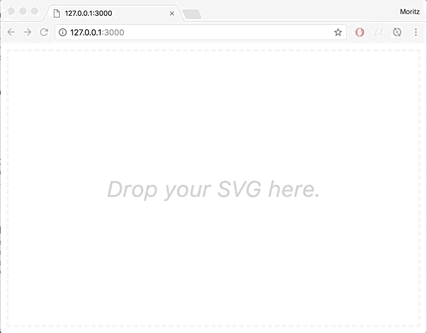

# Color SVG

Color your SVG in cool colors from [colorhunt.co](http://colorhunt.co/).

## Preview



## Usage

```
git clone https://github.com/mrzmyr/color-svg.git
cd color-svg
npm i
npm start
```

Open [localhost:3000](http://localhost:3000/)

## License

MIT © [mrzmyr](https://github.com/mrzmyr)